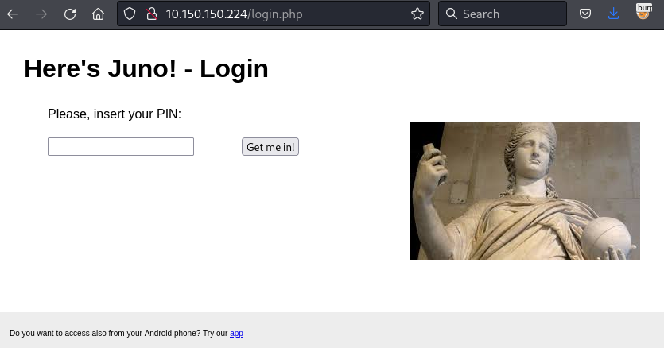

# Juno (10.150.150.224)

## Nmap


```bash
PORT   STATE SERVICE VERSION
80/tcp open  http    Apache httpd 2.4.41 ((Ubuntu))
| http-methods: 
|_  Supported Methods: HEAD GET POST OPTIONS
|_http-server-header: Apache/2.4.41 (Ubuntu)
|_http-title: Apache2 Debian Default Page: It works
```


[http://10.150.150.224/login.php](http://10.150.150.224/login.php)

<figure><figcaption></figcaption></figure>

Download JunoClient.apk and decompile it with jadx.

<figure><figcaption></figcaption></figure>

Password is stored in string variable "YouKnoWhat". Strings values can be found under Resources -> resources.arsc -> res -> values -> strings.xml.

### FLAG43

<figure><figcaption></figcaption></figure>

### FLAG44

Login to http://10.150.150.224/login.php with the string.

<figure><figcaption></figcaption></figure>

### FLAG45

Identify the possible cipher [https://www.dcode.fr/cipher-identifier](https://www.dcode.fr/cipher-identifier)

<figure><figcaption></figcaption></figure>

Try the one with the most possible result.

<figure><figcaption></figcaption></figure>

